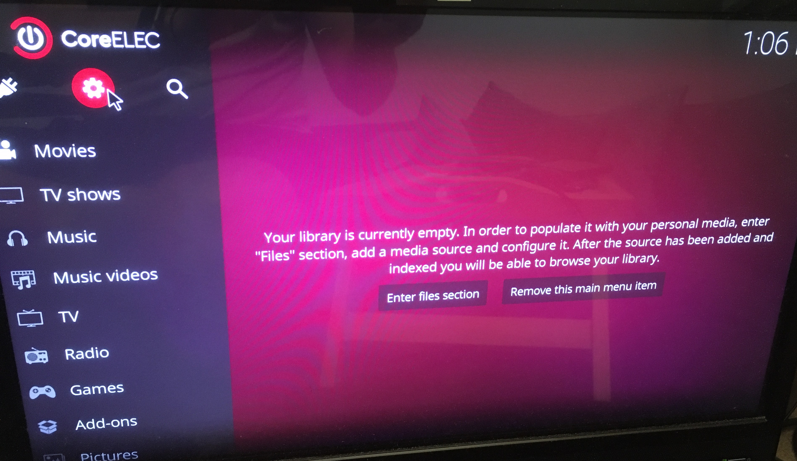
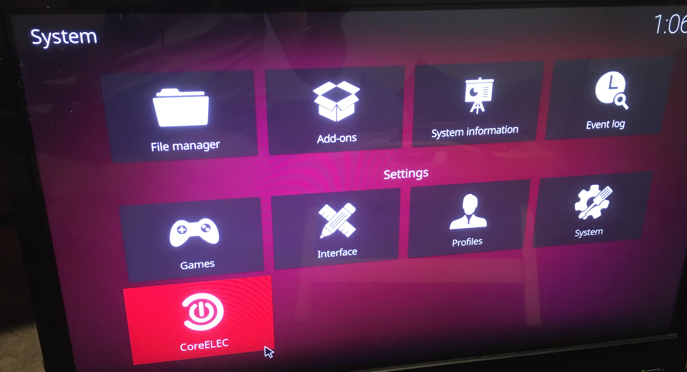
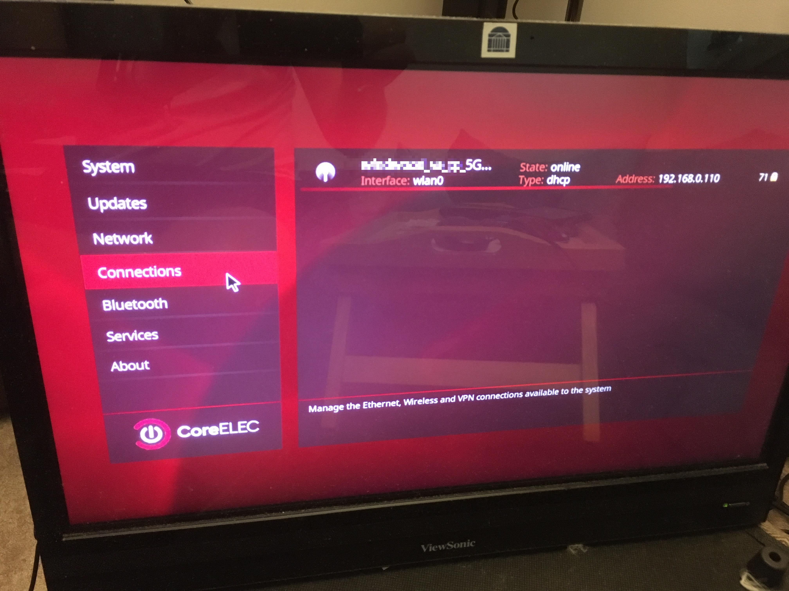
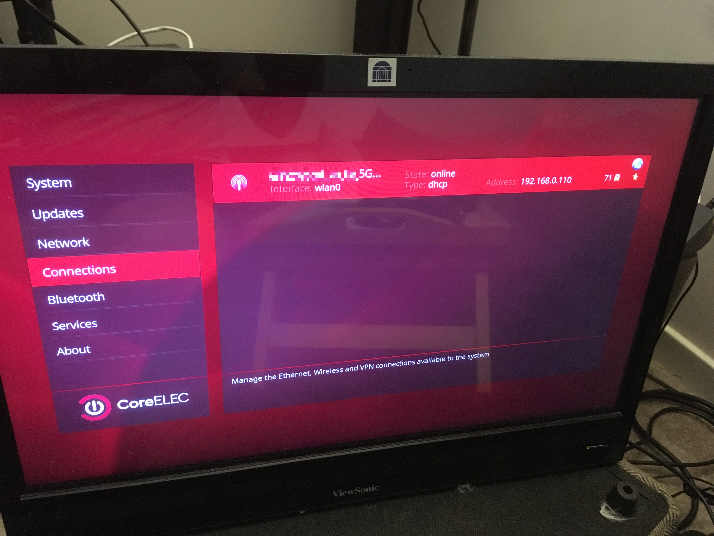
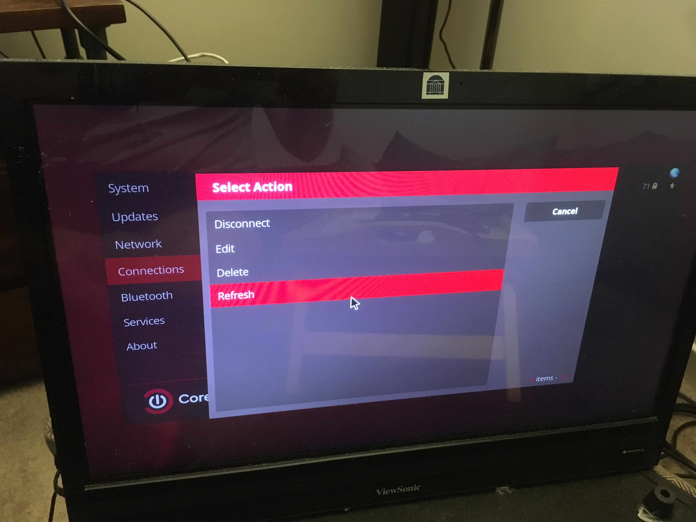
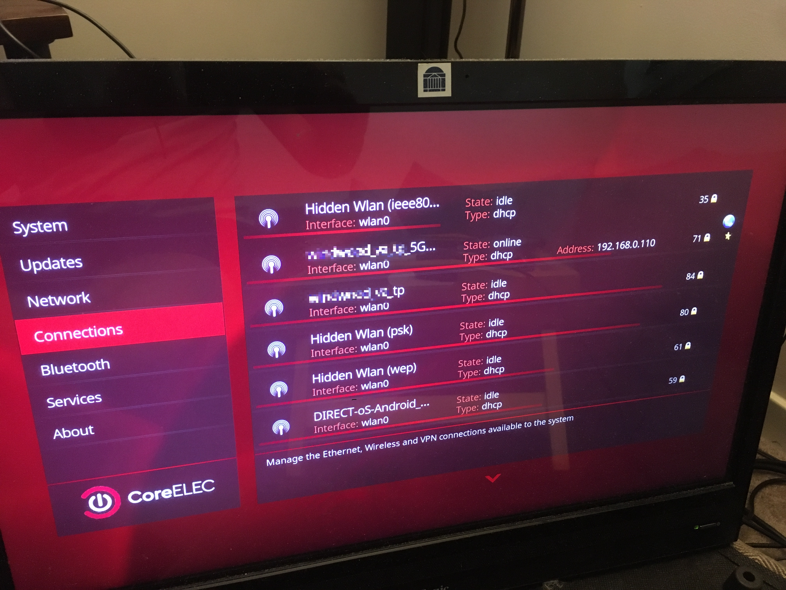

### Getting Started Guide for Demodulator Remote Debug Receiver

#### The Basics
The remote debug receiver device runs a custom Linux build from the installed SD-Card, please do not remove this card.
The Device will need to be connected to the internet either via Wifi or a wired Ethernet connection to allow remote debugging
of the Demodulator in the field. A Terrestrial Antenna should be connected to the Belling-Lee connector for DVB-T/T2/C and ISDB-T debug while a 
pointed dish/LNB feed should be connected to the F-type connector for DVB-S/S2 debug.

#### Controlling the box
The receiver can be controlled with either the supplied IR remote controller or with a USB mouse and keyboard.

#### Configuring the network
If you are using a wired connection to a DHCP enabled gateway, then all you should need to do is connect the Ethernet jack to an active
port on your network.  If you are using Wifi,  you will need to follow this procedure:

1. From the CoreElec home screen, click on the gear icon in the upper left to go to settings
 
2. Next, click the CoreElec logo button to go to system settings

3. Under Connections select the first or active connection and click enter

4. Click Refresh and wait until the list of available Wifi networks is displayed

5. Select your network

